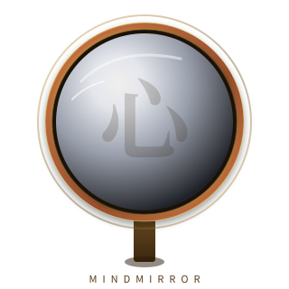
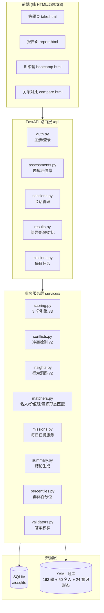

<p align="center">
  
</p>

<h1 align="center">心镜 MindMirror</h1>

<p align="center">
  三面镜子,映照真实的你。<br/>
  一套基于情境与行为轨迹的人格测评工具
</p>

<p align="center">
  <a href="LICENSE"></a>
  
  
  
  
  
  
  
  
</p>

<p align="center">
  <a href="#快速开始">快速开始</a> ·
  <a href="#三面镜子">三面镜子</a> ·
  <a href="#九种答题方法">九种答题方法</a> ·
  <a href="#项目架构">项目架构</a> ·
  <a href="#api-文档">API 文档</a> ·
  <a href="CONTRIBUTING.md">贡献指南</a> ·
  <a href="CHANGELOG.md">更新日志</a>
</p>

---

心镜不满足于简单的量表打分。通过九种答题方法、全程行为采集与多维冲突分析,它试图在那些你**犹豫、改主意、凭直觉反应**的瞬间,捕捉到比"你选了什么"更真实的信号。

这不是一份"测出你的 MBTI"的娱乐问卷。每一道题都把人放进真实的历史两难或价值困境,看你怎么选;每一个答案都附带行为数据——作答耗时、改主意次数、操作轨迹——这些数据**直接参与计分**,而非辅助信息。

最终你得到的不只是一个标签,而是:七维人格画像、与历史名人的灵魂距离、道德光谱定位、政治坐标定位、内在冲突报告、行为洞察六维、群体百分位。

## ✨ 特性

- 🎭 **三面镜子** — 名人镜 / 价值镜 / 意识镜,共 163 道题
- 🧩 **九种答题方法** — 量表、困境、滑块、强迫抉择、矩阵、拍卖、分配、排序、IAT
- 📊 **行为轨迹计分** — 耗时、改主意次数、操作轨迹直接参与计算
- ⚔️ **冲突检测** — 揪出跨题型的维度矛盾、IAT 内隐与外显分裂、犹豫模式
- 🎯 **六维行为洞察** — 决策风格、一致性、纠结度、勇气指数、时间压力效应、内隐偏向
- 🌐 **三语 i18n** — 中文 / English / 日本語,自研引擎无外部依赖
- 🔒 **安全加固** — JWT + pbkdf2 哈希、限流、生产 fail closed、统一 404 防枚举
- 📅 **留存飞轮** — 教官每日任务、连续打卡、铁血徽章
- 🎨 **古典视觉** — Fraunces 可变衬线 + Noto Serif SC,Glassmorphism 2.0
- 📦 **零构建前端** — 纯 HTML/JS/CSS,直接部署

## 🪞 三面镜子

| 镜子 | 题数 | 题库规模 | 维度数 | 估时 |
| :--- | :---: | :---: | :---: | :---: |
| **名人镜** | 54 | 50 位历史名人 | 7 | 25 分钟 |
| **价值镜** | 54 | — | 6 | 18 分钟 |
| **意识镜** | 55 | 24 种意识形态 | 8 | 15 分钟 |

- **名人镜** — 与历史名人对望。从林肯的坚守到图灵的内向天才,测出你与谁的灵魂底色最相近。
- **价值镜** — 价值坐标定位。从利他、公正、诚实到自律,刻画你的道德光谱。
- **意识镜** — 政治光谱定位。经济轴与社会轴交叉,定位你与哪种意识形态最接近。

## 🧩 九种答题方法

心镜不止于"选一个"。每种题型都在测量不同层面的你:

| 题型 | 测什么 | 答案格式 |
| :--- | :--- | :--- |
| **量表** (scale) | 稳定倾向 | `{ option_id: "3" }` |
| **困境** (dilemma) | 真实历史两难中的取舍 | `{ option_id: "a" }` |
| **滑块** (slider) | 连续光谱上的强度 | `{ position: 75 }` |
| **强迫抉择** (forced_choice) | 无中间地带的二选一 | `{ choice: "side_a" }` |
| **矩阵** (matrix) | 多陈述的同意度结构 | `{ ratings: { s1: 6, s2: 4 } }` |
| **拍卖** (auction) | 用预算竞拍价值观 | `{ bids: { item1: 30, item2: 20 } }` |
| **分配** (allocation) | 资源优先级 | `{ allocation: { t1: 40, t2: 60 } }` |
| **排序** (sort) | 拖拽排序,记录轨迹 | `{ order: ["a", "b", "c"] }` |
| **IAT** (iat) | 内隐联想,反应时 | `{ iat: [{ word, category, response, rt, correct }, ...] }` |

**量表与困境**是基础——前者测稳定倾向,后者把人放进真实的历史两难。**滑块与强迫抉择**逼出极端:连续光谱上没有安全的中间点,二选一时没有逃避余地。**矩阵与拍卖**测量结构化信念——后者用有限预算竞拍价值观,出价即真实排序。**分配与排序**直接暴露优先级。**内隐联想(IAT)**测的是你自己都没意识到的偏向——凭直觉快速分类,反应时的差异比任何深思熟虑都诚实。

## 📐 行为轨迹计分

每个答案都附带 `duration_ms` / `change_count` / `trajectory` 三项行为数据,直接参与计分:

- 耗时 3-15 秒的答案权重最高;秒选的降权(太随意),超时的降权(可能本能而非思考)
- 改主意两次以上的降权——价值未定型的信号弱于笃定的选择
- 排序题的位置权重非线性递减,第一名和第二名的差距远大于第四和第五

## 🏗️ 项目架构



## 🚀 快速开始

### 环境要求

- Python 3.12+
- [uv](https://docs.astral.sh/uv/) (推荐) 或 pip

### 安装与启动

```bash
# 1. 克隆仓库
git clone https://github.com/weed33834/mindmirror.git
cd mindmirror

# 2. 复制环境配置(默认为本地开发模式,无需任何外部凭据)
cp .env.example .env

# 3. 安装依赖(用 uv,推荐)
uv sync --extra dev

# 4. 启动开发服务器(自动重载)
uv run fastapi dev app/main.py --host 0.0.0.0 --port 8000
```

启动后访问:

- 应用首页: <http://localhost:8000/>
- API 文档: <http://localhost:8000/api/docs>
- 健康检查: <http://localhost:8000/api/health>

### 用 pip(替代方案)

```bash
pip install -e ".[dev]"
fastapi dev app/main.py
```

### 跑测试

```bash
uv run pytest tests/         # 29 个测试,全过
uv run ruff check .          # 静态检查
uv run mypy app/             # 类型检查
```

## 📡 API 文档

| 方法 | 路径 | 说明 | 鉴权 |
| :--- | :--- | :--- | :---: |
| `POST` | `/api/auth/register` | 注册(邮箱+密码) | — |
| `POST` | `/api/auth/login` | 登录,返回 Bearer JWT | — |
| `GET` | `/api/assessments` | 三面镜子元信息 | — |
| `GET` | `/api/assessments/{type}/questions` | 取某面镜子完整题库 | — |
| `POST` | `/api/sessions?assessment_type={type}` | 开始或恢复测评 | 可选 |
| `POST` | `/api/sessions/{id}/responses` | 提交答案(`complete=true` 触发计分) | 可选 |
| `GET` | `/api/sessions/{id}/result` | 按会话取结果 | 必须 |
| `GET` | `/api/me/results` | 我的历史结果列表 | 必须 |
| `GET` | `/api/results/{id}` | 按 ID 取结果 | 必须 |
| `GET` | `/api/results/{id}/public` | 公开摘要(不泄露归属) | — |
| `GET` | `/api/compare?other={id}` | 与对方公开摘要对比 | 必须 |
| `POST` | `/api/goals` | 创建训练目标 | 必须 |
| `GET` | `/api/goals/me` | 取当前用户最新目标 | 必须 |
| `GET` | `/api/missions/today` | 取今日任务(无则自动生成) | 必须 |
| `POST` | `/api/missions/{mid}/tasks/{tid}/complete` | 切换任务完成态 | 必须 |
| `GET` | `/api/missions/streak` | 连续天数 + 铁血徽章 | 必须 |

完整请求/响应 schema 见 `/api/docs` Swagger UI。

## 📁 目录结构

```
mindmirror/
├── app/
│   ├── api/
│   │   ├── routes/        # 5 个路由文件:auth/assessments/sessions/results/missions
│   │   └── __init__.py    # router 注册
│   ├── core/              # 配置/DB/安全/JWT/限流/依赖注入/日志
│   ├── data/              # YAML 题库加载器
│   ├── models/            # SQLAlchemy 2.0 声明式,ULID 主键
│   ├── schemas/           # Pydantic v2,9 种答题类型判别联合
│   ├── services/          # 业务层:scoring/conflicts/insights/matchers/...
│   └── main.py            # FastAPI 入口
├── data/
│   ├── questions/         # 题库(3 镜 163 题,YAML 驱动)
│   ├── figures/           # 名人库(50 位)
│   ├── ideologies/        # 意识形态库(24 种)
│   └── training/          # 教官每日任务模板
├── static/                # 前端纯 HTML/JS/CSS + SVG 肖像
│   ├── images/
│   │   ├── logo.svg       # 项目 LOGO
│   │   └── celebrities/   # 50 位名人风格化 SVG 肖像
│   ├── app.js             # API 客户端 + 行为采集
│   ├── take.js            # 答题页(9 题型渲染)
│   ├── report.js          # 报告页(ECharts 雷达图)
│   ├── bootcamp.js        # 训练营状态机
│   ├── compare.js         # 关系对比
│   ├── i18n.js            # 三语引擎(中/EN/日)
│   └── styles.css         # Glassmorphism 2.0 样式
├── tests/                 # pytest,含安全门禁测试套件
├── .github/               # Issue/PR 模板
├── AGENTS.md              # 协作规约
├── CONTRIBUTING.md        # 贡献指南
├── CODE_OF_CONDUCT.md     # 行为准则
├── SECURITY.md            # 安全政策
├── CHANGELOG.md           # 更新日志
├── LICENSE                # MIT
└── pyproject.toml         # 项目配置
```

## 🛠️ 技术栈

| 层 | 技术 |
| :--- | :--- |
| **后端框架** | FastAPI 0.118+ (async) |
| **ORM** | SQLAlchemy 2.0 async |
| **数据库** | aiosqlite(可平滑切换 Postgres) |
| **数据校验** | Pydantic v2 |
| **配置** | pydantic-settings |
| **认证** | PyJWT (HS256) + pbkdf2_hmac |
| **时区** | pendulum (Asia/Shanghai) |
| **主键** | python-ulid(时间有序) |
| **题库** | YAML 数据驱动(PyYAML) |
| **前端** | 原生 HTML/JS/CSS(无构建) |
| **图表** | ECharts 5 |
| **字体** | Fraunces + Noto Serif SC |
| **测试** | pytest + pytest-asyncio + httpx.ASGITransport |
| **Lint** | ruff + mypy |
| **包管理** | uv |

## 🔒 安全

详见 [SECURITY.md](SECURITY.md)。要点:

- JWT 认证(HS256),密码 pbkdf2_hmac(sha256, 20w 轮) + 16 字节随机 salt
- `hmac.compare_digest` 常量时间比较防时序攻击
- per-user 60s 固定窗口限流,超频 429
- 答案服务端逐题校验(422),不信任前端
- 跨用户资源访问统一 404,不区分「不存在」与「非本人」(防枚举)
- 前端所有动态 HTML 经 `escapeHtml` 转义防 XSS
- 生产环境 fail closed:`validate_production()` 拒绝 debug/local/sqlite/默认 secret 启动

## 🗺️ 路线图

- [x] 三面镜子测评框架
- [x] 9 种答题方法 + 行为轨迹计分
- [x] JWT 真实登录 + 匿名 UUID 双模
- [x] 留存飞轮(教官每日任务 + 铁血徽章)
- [x] 关系对比
- [x] 三语 i18n
- [ ] wx 微信小程序登录(需 appid/secret 外部凭据)
- [ ] 多实例限流迁移 Redis
- [ ] 生产 Postgres + Alembic 迁移
- [ ] 更多历史名人与意识形态

## 🤝 贡献

欢迎贡献!提 PR 前请先读 [CONTRIBUTING.md](CONTRIBUTING.md),关键约定见 [AGENTS.md](AGENTS.md)。

- 🐛 [报告 bug](https://github.com/weed33834/mindmirror/issues/new?template=bug_report.md)
- 💡 [提功能建议](https://github.com/weed33834/mindmirror/issues/new?template=feature_request.md)
- 🔒 安全漏洞按 [SECURITY.md](SECURITY.md) 私下报告,**不要**公开提 issue

## 📊 数据规模

| 数据集 | 数量 | 文件 |
| :--- | :---: | :--- |
| 题目总数 | 163 | `data/questions/*.yaml` |
| 历史名人 | 50 | `data/figures/celebrity.yaml` |
| 意识形态 | 24 | `data/ideologies/ideology.yaml` |
| 训练任务模板 | 10 | `data/training/mission_templates.yaml` |
| 名人 SVG 肖像 | 50 | `static/images/celebrities/` |

## 📜 声明

心镜是**自我探索工具**,不构成医疗诊断、心理评估或任何专业意见。结果仅供自我探索与娱乐参考。

名人维度分值基于历史人物典型行为特征评估,非精确测量,仅供测评娱乐。名人为程序化生成的风格化 SVG 肖像,非真实照片,避免版权风险。

## 📄 许可证

[MIT License](LICENSE) © 2026 badhope
